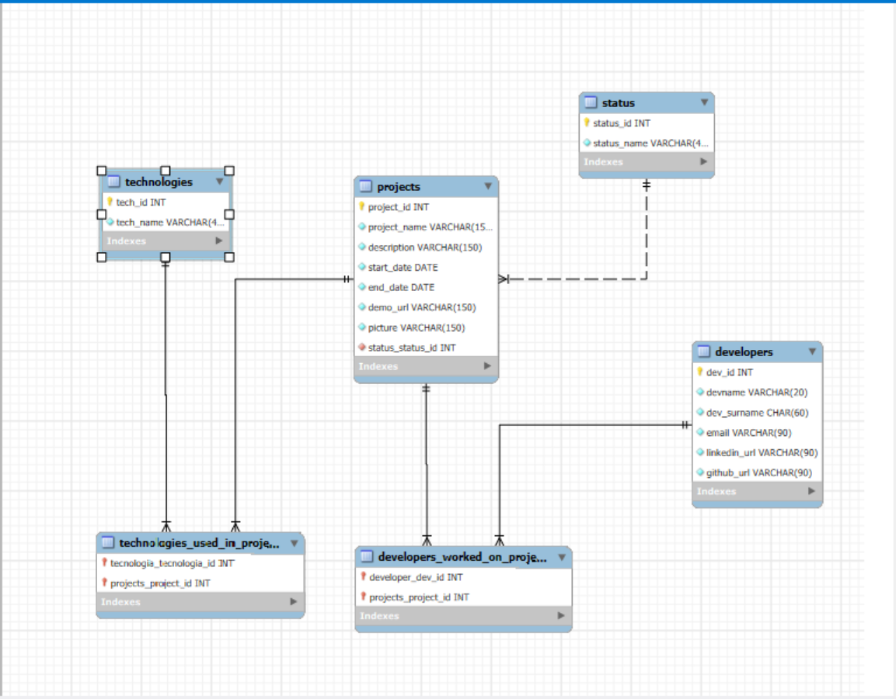

# final-SpringBoot--JuanFernandezescolastico

## DESCRIPCIÓN

API REST desarrollada en Spring Boot 3 para gestionar proyectos tecnológicos, desarrolladores, tecnologías y estados. El sistema permite realizar operaciones CRUD completas sobre todas las entidades mediante endpoints REST.

## Tecnologías utilizadas

1. Java 21.0.6 - Lenguaje de programación
2. Spring Boot - FrameWork principal
3. Spring Data JPA - Persistencia de datos
4. MySQL 8.0 - Base de datos
5. Lombok - Reducción de código
6. Maven - Gestor de dependencias

## Relaciones entre tablas

1. Project - Developer (Many-to-Many)

    Un proyecto puede tener múltiples desarrolladores

    Un desarrollador puede trabajar en múltiples proyectos

    Tabla intermedia: developers_worked_on_projects

2. Project - Technology (Many-to-Many)

    Un proyecto puede usar múltiples tecnologías

    Una tecnología puede ser usada en múltiples proyectos

    Tabla intermedia: technologies_used_in_projects

3. Project - Status (Many-to-One)

    Muchos proyectos pueden tener un mismo estado

    Cada proyecto tiene un único estado

## Endpoints que he implementado

### Proyectos (/api/v1/projects)

1. GET /projects - Obtener todos los proyectos con sus relaciones (status, technologies,  developers)

2. GET /projects/{word} - Buscar proyectos por palabra en el nombre

3. GET /projects/{id} - Obtener un proyecto por ID

4. POST /projects - Crear un nuevo proyecto

5. PUT /projects/{id} - Actualizar proyecto existente

6. DELETE /projects/{id} - Eliminar proyecto

### Desarrolladores (/api/v1/developers)

1. GET /developers - Obtener todos los desarrolladores

2. GET /developers/{id} - Obtener un desarrollador por ID

3. POST /developers - Crear nuevo desarrollador

4. PUT /developers/{id} - Actualizar un desarrollador existente

5. DELETE /developers/{id} - Eliminar desarrollador

### Tecnologías (/api/v1/technologies)

1. GET /technologies - Obtener todas las tecnologías

2. GET /technologies/{id} - Obtener una tecnología por ID

3. POST /technologies - Crear una nueva tecnología

4. PUT /technologies/{id} - Actualizar una tecnología existente

5. DELETE /technologies/{id} - Eliminar tecnología

### Estados (/api/v1/status)

1. GET /status - Obtener todos los estados

2. GET /status/{id} - Obtener un estado por ID

3. POST /status - Crear nuevo estado

4. PUT /status/{id} - Actualizar estado existente

5. DELETE /status/{id} - Eliminar un estado

### Endpoints Extra Implementados

1. GET /developers - Ontener todos los desarrolladores

2. GET /developers/{id} - Obtener un desarrollador por if

3. POST /developers - Crear un nuevo desarrollador

4. PUT /developers/{id} - Actualización de desarrollador

5. GET /technologies - Listado completo de tecnologías

6. GET /technologies/{id} - Detalle de tecnología específica

7. POST /technologies - Crear una nueva tecnología

8. PUT /technologies/{id} - Actualización de tecnología

9. GET /status - Obteneer todos los estados

10. GET /status/{id} - Obtener un estado por id

11. POST /status - Crear un nuevo estado

12. PUT /status{id} - Modificar un estado

13. DELETE /status/{id} - Eliminar un estado

# Esquema de base de datos con sus relaciones

## 📊 Diagrama de Base de Datos

